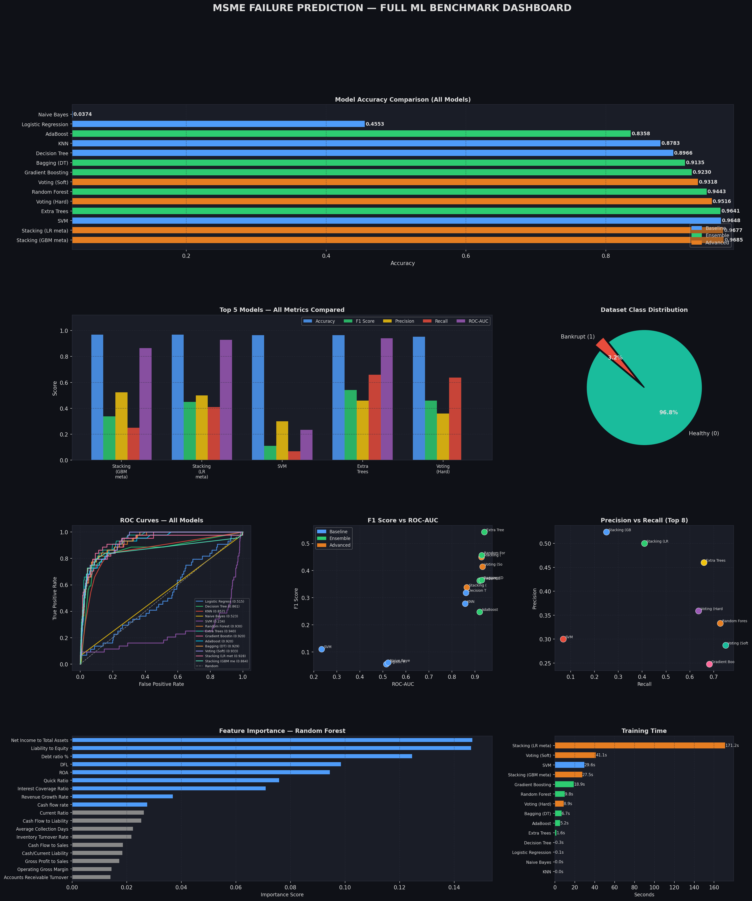

# MSME Failure Predictor

An AI-powered financial health analysis tool for Micro, Small & Medium Enterprises (MSMEs). Input financial ratios and receive instant bankruptcy risk predictions backed by a Stacking GBM ensemble model, plus actionable improvement advice from HuggingFace AI.



---

## Table of Contents

- [Prerequisites](#prerequisites)
- [Quick Start Guide](#quick-start-guide)
  - [Step 1: Download / Clone the Project](#step-1-download--clone-the-project)
  - [Step 2: Create a Virtual Environment](#step-2-create-a-virtual-environment)
  - [Step 3: Install Dependencies](#step-3-install-dependencies)
  - [Step 4: Configure Environment Variables (Optional)](#step-4-configure-environment-variables-optional)
  - [Step 5: Train the ML Model](#step-5-train-the-ml-model)
  - [Step 6: Start the Server](#step-6-start-the-server)
  - [Step 7: Open the Dashboard](#step-7-open-the-dashboard)
- [How to Use the Dashboard](#how-to-use-the-dashboard)
- [Project Structure](#project-structure)
- [API Endpoints](#api-endpoints)
- [Model Architecture](#model-architecture)
- [Features Used](#features-used-18-financial-ratios)
- [Troubleshooting](#troubleshooting)
- [Tech Stack](#tech-stack)

---

## Prerequisites

Before you begin, make sure you have the following installed on your system:

| Software   | Version                        | Download Link                                                |
| ---------- | ------------------------------ | ------------------------------------------------------------ |
| **Python** | 3.10 or higher (tested on 3.12) | [python.org/downloads](https://www.python.org/downloads/)    |
| **pip**    | Comes with Python              | Included with Python                                         |
| **Git**    | Any recent version             | [git-scm.com/downloads](https://git-scm.com/downloads)      |

> **How to check if Python is installed:**
> Open Command Prompt (Windows) or Terminal (Mac/Linux) and type:
> ```bash
> python --version
> ```
> You should see something like `Python 3.12.x`. If not, install Python first.

> **⚠️ Important (Windows):** During Python installation, make sure to check ✅ **"Add Python to PATH"**. This is critical — without it, `python` commands will not work.

---

## Quick Start Guide

Follow these steps **in order**. Each step takes 1–5 minutes.

### Step 1: Download / Clone the Project


**Option A — ZIP Download:**

1. Download the project as a ZIP file
2. Extract it to any folder on your computer
3. Open Command Prompt / Terminal **inside** the extracted folder

> **💡 Tip:** On Windows, you can type `cmd` in the address bar of File Explorer while inside the project folder to open a terminal there directly.

---

### Step 2: Create a Virtual Environment

A virtual environment keeps the project's dependencies isolated from your system Python. **This step is mandatory.**

**On Windows (Command Prompt):**
```bash
python -m venv env
env\Scripts\activate
```

**On Windows (PowerShell):**
```powershell
python -m venv env
.\env\Scripts\Activate.ps1
```

> **If you get a PowerShell execution policy error**, run this first:
> ```powershell
> Set-ExecutionPolicy -ExecutionPolicy RemoteSigned -Scope CurrentUser
> ```

**On macOS / Linux:**
```bash
python3 -m venv env
source env/bin/activate
```

✅ **How to verify it worked:** Your terminal prompt should now show `(env)` at the beginning:
```
(env) C:\Users\YourName\MSME---Failure---Prediction>
```

> **⚠️ Important:** You must activate the virtual environment **every time** you open a new terminal window to work on this project. If you don't see `(env)` in your prompt, the environment is not active.

---

### Step 3: Install Dependencies

With the virtual environment activated (you should see `(env)` in your prompt), run:

```bash
pip install -r requirements.txt
```

This installs:
- **Flask** — Web server framework
- **Flask-CORS** — Cross-origin request handling
- **scikit-learn** — Machine learning library
- **pandas & numpy** — Data processing
- **imbalanced-learn** — SMOTE for handling class imbalance
- **huggingface-hub** — AI-powered advisory suggestions (optional feature)
- **python-dotenv** — Environment variable management

> **⏳ This may take 2–5 minutes** depending on your internet speed. Wait until you see `Successfully installed ...` at the end.

---

### Step 4: Configure Environment Variables (Optional)

The project uses a HuggingFace API key for the AI-powered advisory chatbot. **This step is optional** — the app will work perfectly without it, using rule-based suggestions instead of AI-generated advice.

**To enable AI advisory:**

1. Go to [huggingface.co](https://huggingface.co/) and create a free account
2. Go to **Settings → Access Tokens → New Token** and create a token
3. Copy the file `.env.example` to `.env`:

   **Windows:**
   ```bash
   copy .env.example .env
   ```

   **Mac/Linux:**
   ```bash
   cp .env.example .env
   ```

4. Open the `.env` file in any text editor and replace the placeholder with your actual key:

   ```env
   HF_API_KEY=hf_your_actual_key_here
   ```

**To skip AI advisory:**

You can skip this step entirely. The app will still work for predictions and provide rule-based improvement suggestions.

---

### Step 5: Train the ML Model

> ⚠️ **This step is mandatory on first run.** The trained model files are not included in the repository (they are too large for Git). You must train the model before you can use the application.

With your virtual environment activated, run:

```bash
python model/train.py
```

**What this does:**
1. Loads the financial dataset from `data/data.csv` (~6,800 companies)
2. Preprocesses and denormalizes the data to real-world scale
3. Applies SMOTE oversampling to handle class imbalance (only ~3% of companies are bankrupt)
4. Trains a Stacking GBM ensemble model (Random Forest + Gradient Boosting + Extra Trees + Decision Tree)
5. Calibrates the optimal prediction threshold
6. Saves the trained model to `model/models/`

**Expected output (takes 1–3 minutes):**
```
================================================================================
MSME FAILURE PREDICTOR - MODEL TRAINING
================================================================================
Loading data from .../data/data.csv
Dataset shape: (6819, 96)
Clipping outliers at p1/p99...
Denormalizing to real-world scale...
Splitting data (80/20 train/test)
Applying SMOTE for class imbalance
Training model (this may take several minutes)...
✓ Model training complete
Evaluating model on test set...

Test Set Metrics:
  Accuracy:  0.95+
  ROC-AUC:   0.86+
  Recall:    0.50

================================================================================
TRAINING COMPLETE ✓
================================================================================
```

> **If you see errors**, make sure:
> 1. You're using the virtual environment (`(env)` in your prompt)
> 2. All dependencies from Step 3 are installed
> 3. The file `data/data.csv` exists

---

### Step 6: Start the Server

With your virtual environment activated, run:

```bash
python run.py
```

**Expected output:**
```
============================================================
  MSME FAILURE PREDICTOR — Backend Server
============================================================
  Server    : http://0.0.0.0:5000
  Frontend  : http://localhost:5000/
  Health    : http://localhost:5000/health
============================================================
 * Serving Flask app 'backend.app'
 * Running on http://127.0.0.1:5000
```

> **🔴 Keep this terminal window open!** The server must be running while you use the app. To stop the server later, press `Ctrl + C`.

---

### Step 7: Open the Dashboard

Open your web browser (Chrome, Firefox, Edge, etc.) and go to:

```
http://localhost:5000/
```

You should see the **MSME Failure Predictor** dashboard with the financial data entry form.

🎉 **The application is now running! You're all set.**

---

## How to Use the Dashboard

### Making a Prediction

1. **Enter Financial Data:** Fill in the 18 financial ratios in the form. Each field has a clear label.

2. **Or Load Sample Data:** Click the **"📋 Load Sample Data"** button to pre-fill the form with a high-risk company profile for testing.

3. **Click "Predict & Get Advice":** The model will predict the bankruptcy risk and display:
   - **Risk Score** (0–100%) — probability of financial failure
   - **Risk Level** — HIGH / MEDIUM / LOW
   - **Status** — AT RISK / STABLE
   - **AI Suggestions** — actionable improvement advice

### Example: High-Risk Company

| Metric               | Value |
| -------------------- | ----- |
| Current Ratio        | 0.3   |
| Debt ratio %         | 95    |
| ROA                  | -0.15 |
| Cash flow rate       | -0.2  |

→ Expected result: **HIGH RISK (~90%+ bankruptcy risk)**

### Example: Healthy Company

| Metric               | Value |
| -------------------- | ----- |
| Current Ratio        | 3.0   |
| Debt ratio %         | 25    |
| ROA                  | 0.15  |
| Cash flow rate       | 0.5   |

→ Expected result: **LOW RISK (~1% bankruptcy risk)**

### AI Chat Advisor

After making a prediction, switch to the **💬 Chat Advisor** tab to ask follow-up questions like:
- "Why is my risk score high?"
- "How can I improve my liquidity?"
- "What should I do about my debt ratio?"
- "What is the most urgent issue I need to fix?"

The chat advisor uses your prediction results as context to give personalized, specific advice.

### Comparison Dashboard

Switch to the **📈 Comparison Dashboard** tab to see a summary of all companies you've analyzed in the current session, with side-by-side risk scores.

---

## Project Structure

```
MSME---Failure---Prediction/
├── backend/                   # Flask REST API
│   ├── app.py                 # Main application & endpoints
│   ├── model_config.py        # Model loader, feature config, utilities
│   └── __init__.py
├── frontend/                  # Vanilla HTML/CSS/JS UI
│   ├── index.html             # Dashboard page
│   ├── script.js              # Frontend logic & API calls
│   └── styles.css             # Styling & animations
├── model/                     # ML model training
│   ├── train.py               # Training pipeline (run this first!)
│   └── models/                # Saved model artifacts (generated after training)
│       ├── stacking_gbm.pkl   # Trained model
│       ├── robust_scaler.pkl  # Feature scaler
│       └── model_metadata.pkl # Training metrics & config
├── data/
│   └── data.csv               # Training dataset (~6,800 companies)
├── docs/
│   ├── BACKEND_GUIDE.md       # Backend API documentation
│   └── COMPLETE_SYSTEM_SUMMARY.md
├── .env.example               # Template for API keys (copy to .env)
├── .gitignore                 # Files excluded from Git
├── requirements.txt           # Python dependencies
├── run.py                     # Server entry point
└── README.md                  # This file
```

---

## API Endpoints

| Method | Endpoint               | Description                                  |
| ------ | ---------------------- | -------------------------------------------- |
| GET    | `/health`              | Health check — verify server and model status |
| POST   | `/api/predict`         | Single company bankruptcy prediction          |
| POST   | `/api/batch-predict`   | Batch predictions for multiple companies      |
| POST   | `/api/feature-insights`| Detailed feature health breakdown             |
| GET    | `/api/model-info`      | Model metadata, metrics, and configuration    |
| POST   | `/api/chat`            | Conversational AI financial advisor           |

### Example API Call (Single Prediction)

```bash
curl -X POST http://localhost:5000/api/predict \
  -H "Content-Type: application/json" \
  -d '{"features": {"Cash flow rate": 0.5, "Cash Flow to Sales": 0.3, "Cash Flow to Liability": 0.8, "Current Ratio": 3.0, "Quick Ratio": 2.5, "Cash/Current Liability": 0.8, "Debt ratio %": 25, "Liability to Equity": 0.5, "Interest Coverage Ratio": 10.0, "DFL": 1.2, "ROA": 0.15, "Operating Gross Margin": 0.4, "Gross Profit to Sales": 0.35, "Net Income to Total Assets": 0.12, "Revenue Growth Rate": 0.15, "Accounts Receivable Turnover": 8.0, "Inventory Turnover Rate": 6.0, "Average Collection Days": 30}}'
```

---

## Model Architecture

| Component            | Details                                                      |
| -------------------- | ------------------------------------------------------------ |
| **Type**             | Stacking Ensemble Classifier                                 |
| **Base Learners**    | Random Forest, Gradient Boosting, Extra Trees, Decision Tree |
| **Meta-Learner**     | Gradient Boosting Classifier                                 |
| **Cross-Validation** | 5-fold Stratified K-Fold                                     |
| **Imbalance Handling** | SMOTE oversampling (80% ratio)                             |
| **Feature Scaling**  | RobustScaler                                                 |
| **Threshold**        | Calibrated via Precision-Recall curve                        |
| **Training Data**    | ~6,800 companies (97% safe, 3% bankrupt)                     |

### Performance Metrics

| Metric                  | Score  |
| ----------------------- | ------ |
| Accuracy                | ~95%   |
| ROC-AUC                 | ~0.87  |
| Recall (Bankruptcy)     | ~50%   |
| Precision (Bankruptcy)  | ~35%   |

---

## Features Used (18 Financial Ratios)

| Category          | Features                                                             |
| ----------------- | -------------------------------------------------------------------- |
| **Liquidity**     | Cash flow rate, Current Ratio, Quick Ratio, Cash/Current Liability   |
| **Solvency**      | Debt ratio %, Liability to Equity, Interest Coverage Ratio, DFL      |
| **Profitability** | ROA, Operating Gross Margin, Gross Profit to Sales, Net Income to Total Assets |
| **Efficiency**    | Accounts Receivable Turnover, Inventory Turnover Rate, Average Collection Days |
| **Growth**        | Revenue Growth Rate, Cash Flow to Sales, Cash Flow to Liability      |

---

## Troubleshooting

### ❌ `python` is not recognized as an internal command
**Cause:** Python is not installed or not added to PATH.
**Fix:** Reinstall Python from [python.org](https://www.python.org/downloads/) and check ✅ **"Add Python to PATH"** during installation.

---

### ❌ `ModuleNotFoundError: No module named 'flask'`
**Cause:** You're not inside the virtual environment.
**Fix:** Activate the virtual environment first:
```bash
# Windows (Command Prompt)
env\Scripts\activate

# Windows (PowerShell)
.\env\Scripts\Activate.ps1

# Mac/Linux
source env/bin/activate
```
Then run `pip install -r requirements.txt` again.

---

### ❌ "Model not loaded" / API Error 503
**Cause:** The model hasn't been trained yet.
**Fix:** Run the training script:
```bash
python model/train.py
```
Then restart the server with `python run.py`.

---

### ❌ Port 5000 is already in use
**Cause:** Another process is using port 5000.
**Fix:** Either:
- Close any other terminal windows running the server
- Restart your computer
- Or change the port in `run.py` (line 32: change `port=5000` to `port=5001`), then access the app at `http://localhost:5001/`

---

### ❌ PowerShell execution policy error
**Cause:** Windows PowerShell blocks script execution by default.
**Fix:** Run this command first:
```powershell
Set-ExecutionPolicy -ExecutionPolicy RemoteSigned -Scope CurrentUser
```

---

### ❌ AI advisory shows "fallback" / "rule-based" instead of AI responses
**Cause:** HuggingFace API key is not configured.
**Fix:** This is optional. See [Step 4](#step-4-configure-environment-variables-optional) to set it up. The app still works perfectly with rule-based suggestions.

---

### ❌ Training takes too long or crashes
**Cause:** Insufficient system resources.
**Fix:** The training typically takes 1–3 minutes. If it takes longer:
- Close other resource-heavy applications
- Ensure you have at least 4 GB of free RAM
- If it crashes with a memory error, try restarting your computer and running again

---

## Tech Stack

| Layer        | Technology                                    |
| ------------ | --------------------------------------------- |
| Frontend     | HTML5, CSS3, Vanilla JavaScript               |
| Backend      | Python, Flask, Flask-CORS                     |
| ML           | scikit-learn, imbalanced-learn, pandas, numpy |
| AI Advisory  | HuggingFace Inference API (Qwen model)        |
| Data         | Taiwan Economic Journal bankruptcy dataset    |

---

